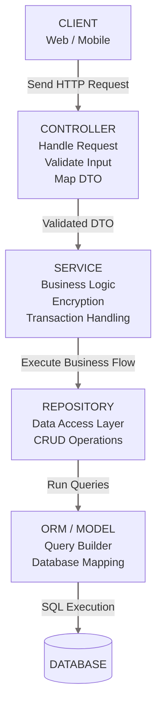

# Developer Guide Patten: 
## Controller-Service-Repository-DTO Architecture

This guide defines the engineering standard for Separation of Concerns (SoC) in our project ecosystem. Follow this architecture to keep the codebase modular, highly testable, secure, and easy to scale.

---

## Architecture Overview
The system is split into four distinct logic layers plus a data contract layer (DTO).




| Layer / Component | Target Communication | Handles HTTP? | Handles Database? |
|---|---|---|---|
| 1. Controller | Client & Service | Yes (req, res) | No |
| 2. DTO | Controller & Service | No | No |
| 3. Service | Controller & Repository | No | No |
| 4. Repository | Service & Model | No | Yes (ORM/SQL Queries) |
| 5. Model | Repository | No | Yes (Schema Definition) |

---
## Component Responsibilities & Ground Rules
### 1. Controller Layer (The HTTP Gateway)
The Controller acts strictly as a receptionist. Its only job is to accept incoming HTTP requests from the client, parse the data, and return the appropriate HTTP response.

* DO:
* Extract data from req.body, req.params, or req.query.
   * Sanitize inputs and assign them to a DTO object.
   * Determine and return the correct HTTP Status Codes (200, 201, 400, 404, 500).
* DO NOT:
* Write database queries or directly use ORM methods.
   * Execute core business logic, calculations, or data transformations.
   * Handle password hashing or encryption algorithms.

### 2. DTO (Data Transfer Object)
A DTO is an object that defines the strict contract for data moving between layers, specifically from the Controller to the Service.

* DO:
* Use the suffix DTO for all interfaces or classes (e.g., CreateUserDTO).
   * Mark properties as readonly to maintain immutability.
   * Protect against over-posting attacks by whitelisting fields.
* DO NOT:
* Contain any functional methods or business logic.

### 3. Service Layer (The Business Logic Brain)
The Service is the heart of the application. This is where all business rules, company policies, and application algorithms live.

* DO:
* Enforce business validation rules (e.g., Checking if an email is already taken).
   * Perform cryptographic operations (e.g., Hashing passwords using bcrypt).
   * Integrate third-party APIs (e.g., Payment Gateways, Notification Services).
   * Accept and return pure JavaScript/TypeScript objects.
* DO NOT:
* Import or interact with Express-specific objects like req or res.
   * Know anything about HTTP protocol details.

### 4. Repository Layer (Data Access Isolation)
The Repository acts as a librarian. Its sole purpose is to fetch data from or persist data to the database.

* DO:
* Be the exclusive home for database queries (Prisma, Sequelize, Mongoose, or raw SQL).
   * Abstract the database technology. If we switch database engines, only this layer changes.
* DO NOT:
* Contain business rules, conditions, or calculations.

### 5. Model Layer (Data Blueprint)
The Model is the digital blueprint of your database structures.

* DO:
* Define table/collection schemas, column data types, and primary/foreign keys.
   * Configure relationships between data structures (e.g., One-to-Many).

---
## Full Implementation Cheat Sheet
Below is a standardized code skeleton for implementing a new feature module using TypeScript and Prisma ORM.
### 1. Model (schema.prisma)
```
model User {
  id        Int      @id @default(autoincrement())
  email     String   @unique
  name      String
  password  String
  createdAt DateTime @default(now())
}
```

### 2. DTO (user.dto.ts)
```
export interface CreateUserDTO {
  readonly email: string;
  readonly name: string;
  readonly password: string;
}
```
### 3. Repository (user.repository.ts)
```
import { PrismaClient, User } from '@prisma/client';
const prisma = new PrismaClient();
export class UserRepository {
  async findByEmail(email: string): Promise<User | null> {
    return await prisma.user.findUnique({ where: { email } });
  }

  async create(data: Omit<User, 'id' | 'createdAt'>): Promise<User> {
    return await prisma.user.create({ data });
  }
}
```

### 4. Service (user.service.ts)
```
import { UserRepository } from './user.repository';
import { CreateUserDTO } from './user.dto';
import { User } from '@prisma/client';
import bcrypt from 'bcrypt';

export class UserService {
  private userRepository = new UserRepository();

  async registerUser(dto: CreateUserDTO): Promise<User> {
    // 1. Business Logic: Check uniqueness
    const userExist = await this.userRepository.findByEmail(dto.email);
    if (userExist) throw new Error("Email already registered");

    // 2. Business Logic: Enforce encryption
    const hashedPassword = await bcrypt.hash(dto.password, 10);

    // 3. Interact with repository
    return await this.userRepository.create({
      name: dto.name,
      email: dto.email,
      password: hashedPassword,
    });
  }
}
```

### 5. Controller (user.controller.ts)
```
import { Request, Response } from 'express';
import { UserService } from './user.service';import { CreateUserDTO } from './user.dto';

export class UserController {
  private userService = new UserService();

  register = async (req: Request, res: Response): Promise<Response> => {
    try {
      // Clean and map request payload to DTO
      const dto: CreateUserDTO = {
        email: req.body.email,
        name: req.body.name,
        password: req.body.password,
      };

      const newUser = await this.userService.registerUser(dto);
      
      const { password: _, ...safeUserOutput } = newUser;
      return res.status(201).json(safeUserOutput);
    } catch (error: any) {
      if (error.message === "Email already registered") {
        return res.status(400).json({ error: error.message });
      }
      return res.status(500).json({ error: "Internal Server Error" });
    }
  };
}
```
